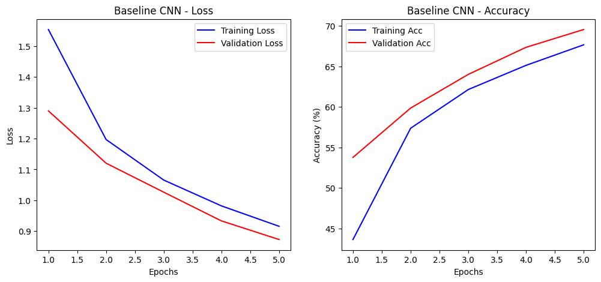
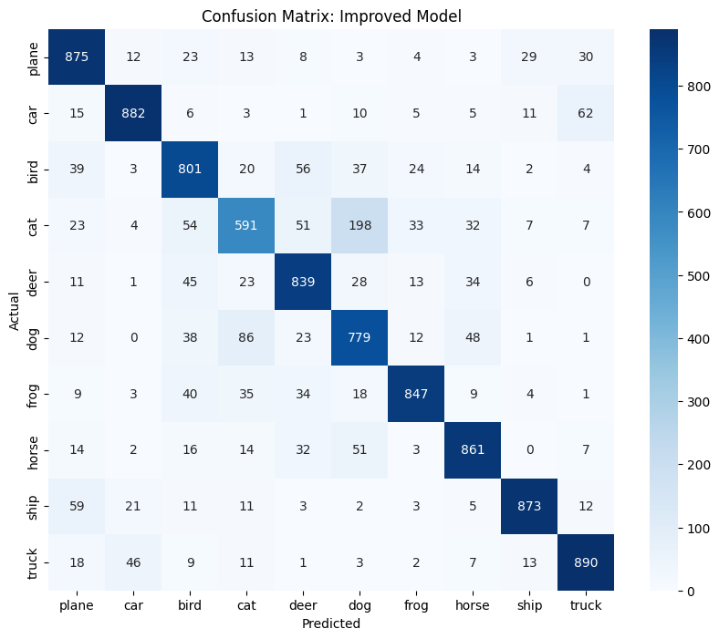

# ICSSR Research Submission: Track 2 - CIFAR-10 Image Classification
## Project: Ethics of AI in E-Governance: Trust, Fairness, and Accountability

**Author:** Praket  
**Academic Background:** 3rd Year B.Tech AI Student (CGPA 9.01)

---

### 1. Project Overview
This repository contains a comparative study between a Baseline CNN and an Improved ResNet-18 architecture. Developed for the ICSSR research initiative, this project evaluates model accountability and transparency in automated classification systems—critical components for building trust in e-governance AI.

### 2. Methodology & Data Strategy
* **Dataset:** CIFAR-10 (60,000 images, 10 classes).
* **Train/Validation Split:** A 90/10 split (45,000 train / 5,000 validation) was used to monitor generalization.
* **Robustness Measures:** Implemented **Data Augmentation** (Horizontal Flips & Random Rotations) to ensure the model remains fair and invariant to object orientation.

### 3. Architecture Comparison
| Feature | Baseline CNN | Improved Model (ResNet-18) |
| :--- | :--- | :--- |
| **Strategy** | Custom 3-Layer Architecture | Transfer Learning (Pre-trained) |
| **Optimization** | Adam (lr=0.001) | Adam (lr=0.0001) |
| **Peak Accuracy** | ~66% | **82.35%** |

### 4. Performance Analytics
The Improved Model reached 82% accuracy in just 10 epochs on a T4 GPU.

#### Learning Curves

(Resnet loss.png)

#### Detailed Classification Report
The model achieved a **Weighted Average F1-Score of 0.82**.

| Class | Precision | Recall | F1-Score |
| :--- | :--- | :--- | :--- |
| **Ship** | 0.92 | 0.87 | 0.90 |
| **Car** | 0.91 | 0.88 | 0.89 |
| **Truck** | 0.88 | 0.89 | 0.88 |
| **Cat** | 0.73 | 0.59 | 0.65 |

### 5. Ethical Analysis (Accountability & Trust)
Using the Confusion Matrix, I identified a significant "Accountability Gap" between animal and vehicle classes.

* **Key Finding:** The model is highly reliable for infrastructure and logistics (Ships, Cars, Trucks > 88% Precision).
* **Bias Observation:** Confusion is highest between **Cats and Dogs** (161 instances). In a governance context, such errors highlight the need for "Human-in-the-loop" verification for visually similar categories to maintain citizen trust.

### 6. How to Run
1. Open `CIFAR_10_Praket.ipynb` in Google Colab.
2. Ensure Runtime is set to **T4 GPU**.
3. Run all cells to reproduce results and verify the saved model weights (`improved_model.pth`).

---
